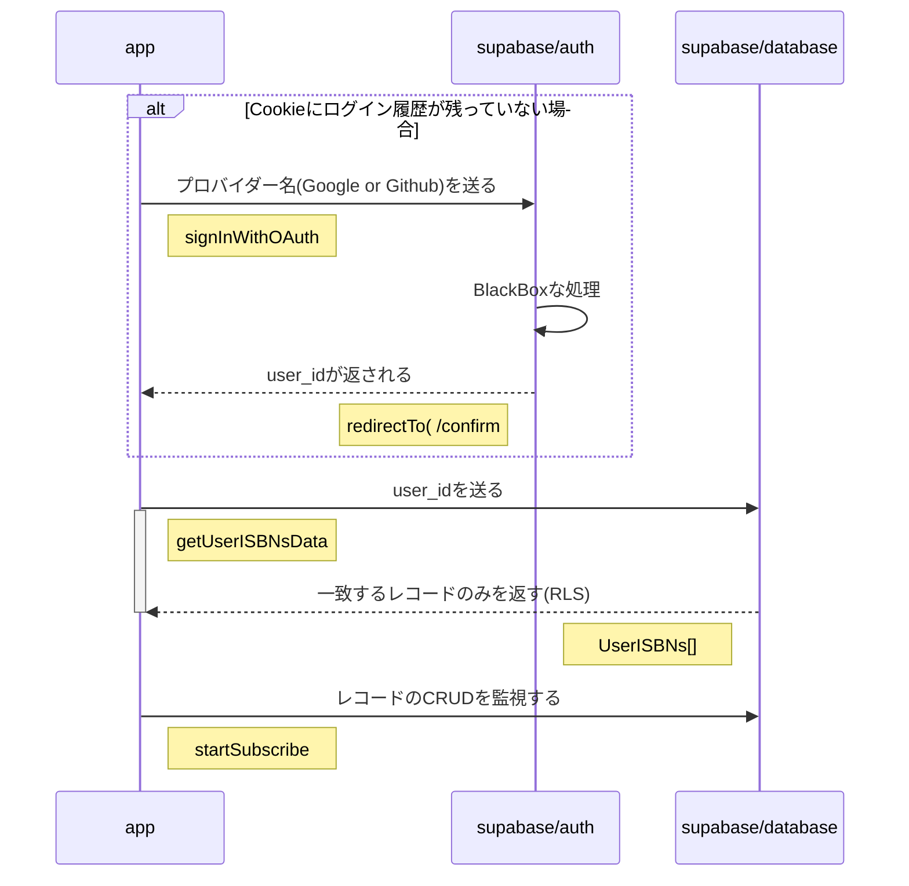
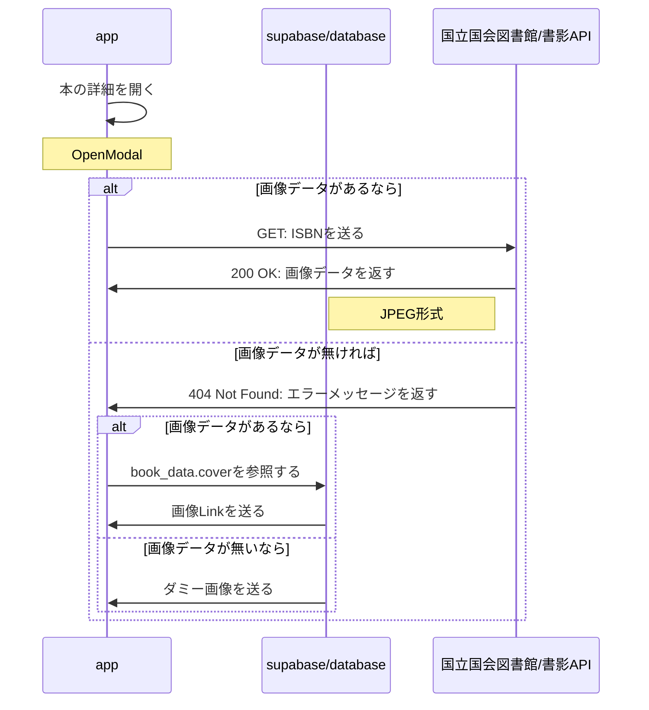
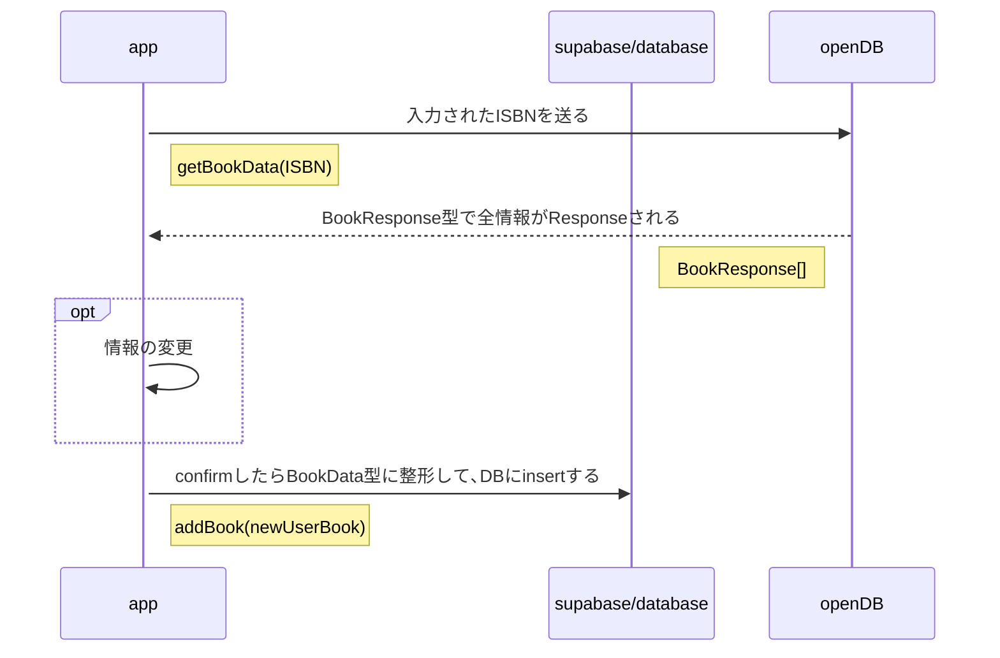

# Virtual Bookshelf
実際の本棚のように､表紙ではなく背表紙がズラッと表示できるサイトです

## できること
- ISBNを入力して半自動的に本の登録､編集､削除､更新が可能
- 本の表紙の画像も表示(登録枚数はとっても少ない)
- OAuth(Google Github)によるログイン
- 本のstateを積読 読書中 既読から選択できる

## 未実装
- カメラでバーコード読み取り
- もうちょっとマシな見た目
- 本のsearch
- 本のsort(登録順､著者順､出版社順､自由)
- Filter機能
## 動画

## 目標
- Supabaseを使ってみる
- Voltaによるissueドリブン開発
- openDBを使ってAPIへの理解度を深める
- Nuxt UIでUIに割り振る脳のリソースを必要最低限にする
- MVPを設定して､短期的なプロジェクト(イテレーション的な)をぶん回す

##  シーケンス図
### ログイン･サインイン及び初回ロード

## 本の書影表示

## 本の登録 (更新･再取得･削除もほとんど一緒)
